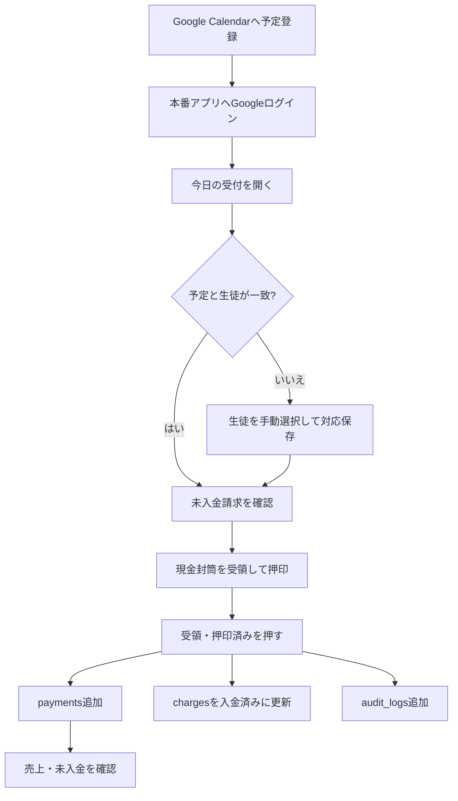

# 運用マニュアル

## 目的

先生が日常業務でピアノ教室運営アプリ Ver.3を安全に使うための手順です。

最終更新日: 2026-07-17

## 日常運用フロー

## 1. ログイン

1. 本番アプリURLを開きます。
2. `Googleでログイン` を押します。
3. 許可済みの先生用Googleアカウントを選びます。
4. 初回はプロフィールとCalendar読取権限を確認して許可します。
5. サイドバーにGoogleアカウントが表示されることを確認します。

許可外アカウントでは利用できません。ログインエラー時はログアウトして最初からやり直します。

## 2. Google Calendarへ予定を登録する

1. Google Calendarを開きます。
2. レッスン日時に予定を作成します。
3. 予定タイトルをアプリの生徒名と同じ表記にします。
4. 保存します。

空白の違いと末尾の「レッスン」は正規化されますが、同名や大きな表記違いは自動決定されません。

## 3. 今日の受付

1. `今日の受付` を開きます。
2. 今日の予定が開始時刻順に表示されることを確認します。
3. `自動照合` の生徒名を確認します。
4. `未照合` の場合は正しい生徒を選び、対応を保存します。
5. 対象の未入金請求と残額を確認します。

## 4. 受領する

1. 現金封筒の生徒名と金額を確認します。
2. 封筒へ受領印を押します。
3. 支払方法と担当者を確認します。
4. `受領・押印済み` を1回だけ押します。
5. 完了表示を確認します。

この操作は、入金追加・請求状態更新・監査ログ追加を一括で行います。連打しないでください。同じCalendar予定の二重処理はDB制約でも拒否されます。

## 5. 入金を取り消す

1. `例外処理` を開きます。
2. 入金履歴から対象を確認します。
3. 取消理由を具体的に入力します。
4. 取消を実行します。
5. 請求状態が残額に応じて戻ったことを確認します。

取消は履歴を削除せず、取消日時と理由を残します。本番確認が現在の課題なので、初回運用では少額テストデータで確認してください。

## 6. 売上を確認する

1. `売上管理` を開きます。
2. 月別、年間、生徒別、発表会費の集計を確認します。
3. 取消済み入金が集計から除外されることを確認します。
4. 必要に応じてCSVまたはExcelを出力します。

売上画面・CSV・Excelは本番データでの最終確認が残っています。

## 7. 月次請求を作成する

1. `月次請求` を開きます。
2. 対象月と支払期限を確認します。
3. 作成を実行します。
4. 作成件数、既存スキップ件数、合計金額を確認します。

同じ生徒・対象月・請求種別の重複はDB制約で防止されます。

## 8. 発表会費請求を作成する

1. `発表会費請求` を開きます。
2. 対象生徒、対象月、金額、期限を確認します。
3. 請求を作成します。
4. 件数と合計金額を確認します。

## 9. 生徒を追加・更新する

1. `生徒管理` を開きます。
2. 氏名、教室、学年、月謝、発表会費、在籍状況を入力します。
3. 保存します。
4. Google Calendarの予定タイトルを登録した生徒名に合わせます。

同姓同名がある場合、自動照合で決定されない設計です。手動対応を利用します。

## 10. バックアップと出力

1. `データ・バックアップ` を開きます。
2. 必要なCSVまたはExcelを生成します。
3. 個人情報を含むため、暗号化・アクセス制限された場所へ保存します。
4. Supabase DashboardでDatabase BackupsまたはPITRの契約・状態を確認します。

ローカルデモではSQLiteバックアップを作成します。本番SupabaseではローカルSQLiteバックアップだけを復旧手段にしないでください。

## 11. デプロイ

1. ローカルテストを実行します。
2. `git diff` で変更を確認します。
3. Secretが含まれないことを確認してコミットします。
4. `origin/main` へpushします。
5. Community CloudのDeploy logsを確認します。
6. 本番でログイン、Calendar表示、主要画面をスモークテストします。

## 毎日の終了確認

- 受付漏れがない
- 未入金一覧を確認した
- エラー表示が残っていない
- 必要な取消に理由が記録されている
- 月末はCSV・Excelを安全な場所へ保管した
