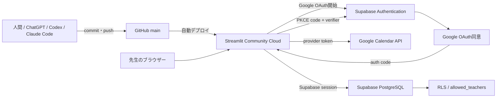

# ChatGPT・Codex・Claude Code 引継ぎ

> [!IMPORTANT]
> このファイルは、次の開発担当者が最初に読む引継ぎ資料です。
> 担当者は人間・ChatGPT・Codex・Claude Codeなどを問いません。
> コードを変更する前に、必ず本ファイルと `docs/04_PROJECT_STATUS.md` を読み、現在の状態を理解してから作業を開始してください。

最終更新日: 2026-07-23（complete_lesson_payment RPCのreceived_date JST対応を実装。本番未適用）

## この文書の目的

数か月後でも10分以内に開発を再開できるように、システム構成、完成済み機能、既知の問題、現在のGit状態、次に行う作業を一か所へまとめます。

この文書に書かれた状態と実際のRepositoryが異なる場合は、`git status`、`git log`、コードを優先し、確認後に本書を更新してください。未コミット変更は所有者の作業であるため、勝手に破棄しません。

> 過去の教訓: 2026-07-23の作業開始時点で、コード（Identity Sequence同期）とテストはコミット済み（`11ec903`）だったにもかかわらず、本ファイルと `docs/04_PROJECT_STATUS.md` は「未コミット」のままの記述で止まっていました。コミットとドキュメント更新は必ずセットで終わらせてください。詳細は `docs/worklog.md` の2026-07-23エントリを参照してください。

## 最初に読む文書

必ず次の順に読みます。

1. `docs/08_CHATGPT引継ぎ.md`（本ファイル）
2. `docs/04_PROJECT_STATUS.md`
3. `docs/worklog.md`（最新エントリ、作業履歴）
4. 必要に応じて `docs/07_トラブルシューティング.md`
5. SQL作業なら `docs/05_よく使うSQL.md`

変更履歴は `docs/09_リリースノート.md` を参照してください。

新しいAIへの最初の依頼文:

```text
まず docs/08_CHATGPT引継ぎ.md、docs/04_PROJECT_STATUS.md、docs/worklog.md を読んでください。現在のGit状態と次回最優先事項を確認し、作業前に実施内容を短く報告してください。
```

## プロジェクト概要

ピアノ教室の生徒、月謝・発表会費請求、現金受領、売上、監査履歴を管理するStreamlitアプリです。

先生はスマートフォンでGoogle Calendarの当日予定を確認し、予定と生徒を照合します。現金封筒へ押印後、`受領・押印済み` を押すと、Supabase上で入金追加、請求状態更新、監査ログ追加が一括実行されます。

- 本番: Streamlit Community Cloud + Supabase + Google OAuth + Google Calendar API
- ローカルデモ: Streamlit + SQLite + 架空Calendar予定
- Repository: `piano-fee-app`
- 本番ブランチ: `main`
- 起動ファイル: `local_web_app/app.py`

## システム構成



| サービス | 役割 |
|---|---|
| GitHub | コード、履歴、`main` ブランチ管理 |
| Streamlit Community Cloud | アプリ公開、Deploy logs、Secrets管理 |
| Supabase PostgreSQL | 生徒、請求、入金、監査、照合、移行履歴 |
| Supabase Authentication | Googleログイン、Supabaseセッション、RLS用JWT |
| Google OAuth | Google本人確認とCalendar読取scopeの同意 |
| Google Calendar API | 当日のレッスン予定取得 |

## 主要フォルダとファイル

```text
piano-fee-app/
├─ docs/
│  ├─ 01_URL一覧.md
│  ├─ 02_起動方法.md
│  ├─ 03_運用マニュアル.md
│  ├─ 04_PROJECT_STATUS.md
│  ├─ 05_よく使うSQL.md
│  ├─ 06_環境変数.md
│  ├─ 07_トラブルシューティング.md
│  ├─ 08_CHATGPT引継ぎ.md
│  ├─ 09_リリースノート.md
│  └─ worklog.md
├─ local_web_app/
│  ├─ app.py
│  ├─ database.py
│  ├─ migrate_to_supabase.py
│  ├─ supabase_schema.sql
│  ├─ supabase_sequence_sync.sql
│  ├─ supabase_received_date_jst_fix.sql
│  ├─ app_pages/
│  ├─ services/
│  ├─ tests/
│  └─ .streamlit/
├─ README.md
├─ 設計書.md
└─ ピアノ教室_レッスン料管理.xlsx
```

| ファイル | 役割 |
|---|---|
| `local_web_app/app.py` | Authコールバック、利用許可、画面切替 |
| `services/auth_service.py` | Supabaseクライアント、Google OAuth、PKCE、セッション |
| `services/calendar_service.py` | Calendar API、デモ予定、タイトル正規化 |
| `services/v3_repository.py` | Supabase／SQLite切替、通常受領RPC（`complete_lesson_payment`呼出し。クラウド分岐は`p_received_date`に`common.today_jst()`を渡す） |
| `services/payment_service.py` | 入金登録、押印、取消 |
| `services/charge_service.py` | 月謝・発表会費請求 |
| `services/student_service.py` | 生徒追加・更新・在籍状態 |
| `services/sales_service.py` | 売上集計。請求月基準（`*_billed_amount`）と受領日基準（`*_received_amount`）を分離して提供する。`daily_received_amount()`/`today_received_amount()`はAsia/Tokyo基準の「本日の受領額」（「今日の受付」画面で使用） |
| `services/common.py` | 監査ログ用`audit()`、Asia/Tokyo基準の`today_jst()`（`sales_service.py`・`v3_repository.py`で共有） |
| `services/export_service.py` | CSV・Excel出力 |
| `services/backup_service.py` | ローカルSQLiteバックアップ |
| `migrate_to_supabase.py` | SQLite移行とIdentity Sequence同期呼出し |
| `supabase_schema.sql` | テーブル、RLS、受領RPC（`complete_lesson_payment`は5引数・JST対応版）、同期RPC |
| `supabase_sequence_sync.sql` | 既存Supabaseへ同期RPCを追加・即時実行 |
| `supabase_received_date_jst_fix.sql` | 既存Supabaseの`complete_lesson_payment`を旧4引数版から新5引数版（JST対応）へ置き換え。本番未適用 |
| `tests/test_migrate_to_supabase.py` | Identity Sequence同期テスト |

## データベース構成

| テーブル | 主キー | 用途 |
|---|---|---|
| `students` | `student_id` Identity | 生徒、料金、在籍情報 |
| `charges` | `charge_id` Identity | 月謝・発表会費等の請求 |
| `payments` | `payment_id` Identity | 受領額、支払方法、押印、取消、Calendar event ID |
| `audit_logs` | `log_id` Identity | 操作監査履歴 |
| `allowed_teachers` | `email` | RLSで許可するGoogleアカウント |
| `calendar_mappings` | `normalized_title` | Calendarタイトルと生徒の手動対応 |
| `migration_runs` | `source_sha256` | SQLite二重移行防止 |

重要な制約・RPC:

- `charges`: 生徒・対象月・請求種別が一意
- `payments_calendar_event_once`: 有効な同一Calendar予定の二重受領を拒否
- `complete_lesson_payment`: 請求行ロック、残額確認、入金、請求更新、監査を1トランザクションで実行。`p_received_date`（省略時`current_date`）でJST基準の受領日を明示可能（本番未適用、下記「既知の問題」参照）
- `sync_migration_identity_sequences`: 明示ID移行後に4つのIdentityシーケンスを最大IDへ同期
- RLS: Google JWT emailが `allowed_teachers` にある利用者だけが業務テーブルを操作

## 完成済み機能

- GitHub連携
- Streamlit Community Cloudへの公開
- Supabase接続
- Supabase PostgreSQLとRLS
- Google OAuth
- PKCE verifier永続化
- Google Calendar API連携
- Calendar予定と生徒の自動照合
- 手動照合結果の保存
- SQLiteからSupabaseへのデータ移行
- 今日の受付
- 受領登録
- Identity Sequence同期（実装・コミット済み: `11ec903`）
- 受領登録時のduplicate keyエラー対策
- プロジェクトドキュメント8ファイル作成
- `docs/` のGitHubへのpush
- ローカルデモと自動テスト
- 作業履歴管理（`docs/worklog.md`）の運用開始
- 売上40,000円問題の修正（請求月基準／受領日基準の分離。ローカル・UIで解消を確認済み、本番実データでの最終確認は次回）
- 「今日の受付」画面の「本日の受領額」DB化（`daily_received_amount()`/`today_received_amount()`、Asia/Tokyo基準、新規RPC無し）
- 受領取消処理の動作確認（不具合なし、回帰テスト8件追加）
- `complete_lesson_payment` RPCのreceived_date JST対応（コード・SQLマイグレーション実装済み。本番未適用）

## 動作確認済み

- Google Calendarの予定を取得できる
- Calendar予定から生徒を照合できる
- 9,000円の受領登録ができる
- 受領後、受領済み1名になる
- 受領後、未受領0名になる
- 受領後、「本日の受領額」が受領額どおりに更新される（DBの`received_date`基準）
- 受領取消後、`payments`は物理削除されず状態が正しく更新され、`charges`が未収状態へ戻り、本日/月別の各集計から除外される
- Identity Sequence同期テスト4件が成功する
- 全体テストスイート36件が成功する
- Streamlit AppTestで売上管理画面の集計基準切替（請求月別⇄受領月別）を確認する
- Streamlit AppTestで「本日の受領額」が受領登録前0円→登録後実額へ更新されることを確認する
- Streamlit AppTestで受領取消後に「本日の受領額」が即時0円へ戻ることを確認する
- フェイクRPCクライアントで、`v3_repository.complete()`のクラウド分岐が`p_received_date`に`today_jst()`を渡すことを確認する

## 未完成機能・未確認事項

- `local_web_app/supabase_received_date_jst_fix.sql` の本番Supabaseへの適用（SQL Editorで手動実行、まだ実施していない）
- 本番Supabase実データでの40,000円内訳の最終確認
- CSV/Excel出力（`export_service.dataset()`）へ請求月基準の出力を追加するかどうかの検討
- `services/dashboard_service.py`のSupabaseクラウド対応（現状デッドコードのため緊急ではない）
- 過去データの`received_date`バックフィル要否（任意・別タスク）
- Excel出力の確認・改善（売上以外の出力項目）
- 本番データでの総合運用テスト
- `docs/01_URL一覧.md` の本番URL・Project名の未設定部分の追記
- Streamlit本番環境でのブラウザ確認

## 既知の問題

### 売上管理・確定申告画面が40,000円と表示される（コード対応済み・本番実データでの最終確認待ち）

原因は、`services/sales_service.py` の集計関数が `received_date`（受領日）の年月だけで対象月を判定し、`target_month`（請求対象月）を無視していたことです。前受金（翌月分を当月中に受領）や後払いがあると、実際の請求額より多く表示されます。ローカルデモDBで再現し、本番報告の「22,000円」という内訳と数値的に一致する構造であることを確認済みです（詳細・再現条件は `docs/worklog.md` の2026-07-23エントリを参照）。

対応として、「請求月ベース（target_month）」と「受領日ベース（received_date）」を統一せず、明確に区別して両方確認できるようにしました。

- `services/sales_service.py`: `monthly_sales`→`monthly_billed_amount`（請求月基準）／`monthly_received_amount`（受領月基準）に分割。`yearly_sales`・`student_yearly_sales`も同様。`recital_sales`は`recital_billed_amount`に改名（ロジック変更なし、発表会費は開催＝target_month基準）。
- `app_pages/sales.py`: 「月別集計」「年間集計」「生徒別年間集計」タブに集計基準の切替ラジオボタンとキャプションを追加。
- `services/export_service.py` / `app_pages/reports.py`: 管理画面のCSV/Excel出力は受領日基準であることを列名・選択肢名で明示（ロジックは未変更）。
- 前受金・後払いを含む回帰テスト（`tests/test_sales_service.py`）を追加し、全14テストが成功。Streamlit AppTestでも請求月基準10,000円／受領月基準30,000円と正しく切り替わることを確認済み。

本番Supabaseの実データはこの開発環境から直接参照できないため（認証情報なし）、40,000円（22,000円＋18,000円）の実データ内訳は未確認です。次回、次のSQLをSupabase SQL Editorで実行して最終確認してください。

```sql
select
  student_name, payment_type, target_month,
  to_char(received_date,'YYYY-MM') as received_month,
  amount_received, received_date, cancelled_at
from public.payments
where cancelled_at is null
  and to_char(received_date,'YYYY-MM') = '対象年月'
order by student_name, received_date;
```

#### 保留とした対応（別タスク）

- CSV/Excel出力へ請求月基準の出力を追加するかどうか。
- `services/dashboard_service.py`のクラウド対応（現状デッドコードのため緊急ではない）。

### 「今日の受付」画面の「本日の受領額」DB化（対応済み）

「今日の受付」画面の「今日の売上」は、ブラウザセッション中の`st.session_state`だけを合算しておりDBを参照していませんでした（再読み込み・別端末で値が消える／一致しない）。`services/sales_service.py`に`daily_received_amount(day=None)`（`day`省略時は`Asia/Tokyo`基準の当日）・`today_received_amount()`を追加し、`app_pages/v3_today.py`のメトリクスを「本日の受領額」としてDB参照（`received_date`が対象日・`cancelled_at is null`の`amount_received`合計）に変更しました。クラウド時はDB側で`received_date`・`cancelled_at`を絞り込んでからPython側で合計する方式で、新規RPCは作成していません。不要になった`st.session_state`の金額集計（`amount_{event_id}`）は削除し、受領済み表示に使う`done_{event_id}`は変更していません。

流用を避けた`services/dashboard_service.py`はSupabaseクラウド非対応（`is_cloud_configured()`分岐が無くローカルSQLite固定）であり、`app_pages/dashboard.py`・`reports.render_daily()`は現在`app.py`から呼ばれていないデッドコードです（変更していません）。

### 受領取消処理の動作確認（対応済み・不具合なし）

`payment_service.cancel_payment`を精読・テストで検証し、明確な不具合は見つかりませんでした。物理削除なし、`cancelled_at`/`cancellation_reason`が正しく設定される、取消後に`charges`が正しい未収状態（請求中／一部入金）へ戻る、取消分は「本日の受領額」・請求月別／受領月別の売上集計すべてから自動的に除外される、二重取消はアプリケーション層のチェックで防止される、取消後の再受領は可能（クラウドの`payments_calendar_event_once`部分ユニークインデックスも取消済み行を除外する設計）ことを確認しました。ローカル・クラウド分岐はフェイククライアントで同一ロジックであることを確認済みです。理論上ミリ秒単位の同時リクエストでのみ起こりうる二重取消の軽微なレース条件を発見しましたが、実害が乏しいため修正は提案していません。回帰テスト8件（`tests/test_payment_cancellation.py`）を追加しました。

### complete_lesson_payment RPCのreceived_dateタイムゾーン問題（コード・SQL実装済み・本番未適用）

「本日の受領額」の集計側はJST基準にしましたが、**登録側**の`complete_lesson_payment` RPC（クラウド「今日の受付」の受領登録経路）は、INSERT文に`received_date`列を含めておらず、テーブル定義の`default current_date`（Postgresサーバーのセッションタイムゾーン）に委ねたままでした。本番SupabaseのDBタイムゾーンは`show timezone;`で`UTC`であることを確認済みです。JST 00:00〜08:59（UTCではまだ前日）に受領登録すると、`received_date`がJSTの実際の日付より1日前で記録される可能性がありました。

#### 対応内容

- RPCに`p_received_date date default null`を追加し、`coalesce(p_received_date,current_date)`でINSERTするよう変更（未指定時のみ`current_date`にフォールバック）。
- 後方互換のための旧シグネチャ温存は行わず、**RPCは常に1つだけ存在する状態**にする方針。`local_web_app/supabase_received_date_jst_fix.sql`で`drop function if exists complete_lesson_payment(bigint,text,text,text);`により旧4引数版を削除してから新5引数版を作成する（先頭にPurpose/Backgroundのコメントあり）。
- `local_web_app/supabase_schema.sql`（新規インストール用の正本）も新5引数版へ更新。
- `services/common.py`に`today_jst()`を新設（`sales_service.py`にあった`_today_jst()`を移設・共有化）。
- `services/v3_repository.py`の`complete()`が、クラウド分岐でRPCへ`p_received_date`として`today_jst()`を明示的に渡すよう変更。ローカル分岐（デモ用SQLite）も`date.today()`から`today_jst()`へ統一。
- テスト: `today_jst()`のタイムゾーン解決、`complete()`クラウド分岐のRPCパラメータ（フェイクRPCクライアント）、マイグレーションSQL・`supabase_schema.sql`の内容（DROPしてからCREATE、`security invoker`維持等）の静的検証を追加。

#### 本番未適用（次回対応）

**コード・SQLは実装・テスト・コミット済みですが、`local_web_app/supabase_received_date_jst_fix.sql`はまだ本番Supabaseに適用していません。** アプリのデプロイと同時にSQL Editorで実行する必要があります。適用前後で次のSQLにより、関数が5引数版1つだけになっていることを確認してください。

```sql
select proname, pg_get_function_identity_arguments(oid)
from pg_proc where proname='complete_lesson_payment';
```

過去に記録済みの`received_date`は自動的には修正されません。バックフィールドが必要かどうかは別途検討します。

## 今回までの重要な修正

### PKCE

問題: Googleから `?code=...` が戻っても、code verifierがStreamlitの外部リダイレクトと再実行をまたげず、Supabaseセッション交換に失敗しました。

対応:

- PKCEを無効化せず維持
- verifierを期限付きサーバー側SQLiteへ保存
- URLにはverifierではなく推測困難なフローIDだけを付与
- verifierが空ならexchangeしない
- 完了後にverifierとquery parameterを削除
- Supabase sessionとGoogle `provider_token` を保持
- 例外本文やtokenを画面・ログへ出さない

### Google Calendar

- OAuth scopeは `openid email profile` とCalendar読取専用scope
- Calendar APIにはSupabase sessionの `provider_token` をBearer tokenとして使用
- 本番Calendarエラー時は架空予定へ自動フォールバックしない
- Calendar予定取得と生徒照合は動作確認済み

### Identity Sequence

問題: SQLiteのIDを `generated by default as identity` 列へ明示挿入してもシーケンスが進まず、次の受領登録で主キー重複が発生しました。

対応:

- `pg_get_serial_sequence()` でIdentity所有シーケンスを取得
- `setval()` で現在の最大IDへ同期
- 対象は `students`、`charges`、`payments`、`audit_logs`
- 空テーブルは次回1、非空テーブルは次回最大ID+1
- `service_role` 専用RPC
- 移行成功後に同期結果を検証

この対応は、コミット `11ec903`（2026-07-23）で反映済みです。関連テスト4件、全体テスト12件が成功しています。

### Supabase移行

- SQLiteを読み取り専用で開く
- 件数とSHA-256をプレビュー
- `--commit` と `MIGRATE` 入力がある場合だけ書き込む
- 既存主キーを上書きせずスキップ
- 全成功後に `migration_runs` へ指紋を保存
- service-role keyは移行時のPowerShellセッションだけで使用

## 現在のGit状態

- `main` は `origin/main` と同期済みです（`git push origin main`実施済み、コミット`3d73daa`まで反映）。
- 今回のRPC対応（`complete_lesson_payment`のreceived_date JST化）は、この後コミットする予定です（正確なコミットIDは `git log --oneline` で確認してください）。この時点で`origin/main`へは未pushです。
- 作業終了時は必ず `git status` で `nothing to commit` になっていることを確認します。

## 次回再開時の手順

### STEP 1: 引継ぎ資料を読む

最初に次を読みます。

- `docs/08_CHATGPT引継ぎ.md`
- `docs/04_PROJECT_STATUS.md`
- `docs/worklog.md`（最新エントリ）

新しいAIへの最初の依頼文:

```text
まず docs/08_CHATGPT引継ぎ.md、docs/04_PROJECT_STATUS.md、docs/worklog.md を読んでください。現在のGit状態と次回最優先事項を確認し、作業前に実施内容を短く報告してください。
```

### STEP 2: 本番Supabaseへマイグレーションを適用する

`local_web_app/supabase_received_date_jst_fix.sql` をSQL Editorで実行します（アプリのデプロイと同時に行う）。適用前後で次を確認します。

```sql
select proname, pg_get_function_identity_arguments(oid)
from pg_proc where proname='complete_lesson_payment';
```

適用後は5引数版が1つだけ存在することを確認します。

### STEP 3: Streamlit本番環境を確認する

Community Cloudの本番アプリを開き、次を順番に確認します。

1. アプリが正常起動する
2. Googleログインができる
3. Google Calendarを取得できる
4. 今日の受付画面が表示される（「本日の受領額」が正しく表示されること）
5. 受領登録ができる（テスト用生徒・請求で実施し、`received_date`が正しいことを確認後、`cancel_payment`で後始末する）
6. 売上管理・確定申告画面（請求月別／受領月別の切替）の表示が正しい
7. エラーが表示されない

本番URLが `docs/01_URL一覧.md` で未設定なら、確認できた時点で追記します。URLだけを記載し、Secretは書きません。

### STEP 4: 本番Supabaseで40,000円問題の実データを最終確認する

`docs/04_PROJECT_STATUS.md`「既知の問題」記載の確認用SQLをSupabase SQL Editorで実行し、内訳が前受金・後払いの混入によるものかを確認します。

### STEP 5: 保留事項を検討する

- CSV/Excel出力へ請求月基準の出力を追加するかどうか
- `services/dashboard_service.py`のSupabaseクラウド対応
- 過去データの`received_date`バックフィル要否

### STEP 6: ドキュメントを更新する

作業終了前に必ず更新します。

- `docs/04_PROJECT_STATUS.md`
- `docs/08_CHATGPT引継ぎ.md`
- `docs/worklog.md`

必要に応じて更新します。

- `docs/05_よく使うSQL.md`
- `docs/07_トラブルシューティング.md`
- `docs/01_URL一覧.md`

次回担当者が古い情報で誤操作しない状態にします。

## 開発ルール

1. 秘密情報をGitHubへ保存しない。
2. `SUPABASE_SERVICE_ROLE_KEY` の実値を書かない。
3. Google Client Secretの実値を書かない。
4. JWT、APIキー、GitHub tokenを書かない。
5. Streamlit Secretsの実値を書かない。
6. 環境変数は変数名、用途、取得場所、設定場所だけを書く。
7. コード修正前に `git status` と `git diff` を確認する。
8. 無関係な変更を同じコミットへ混ぜない。
9. 既存の未コミット変更を勝手に破棄しない。
10. 問題が起きても、原因確認前にreset、checkout、cleanを実行しない。
11. ユーザーは一度に一つずつ進める方が分かりやすいため、操作依頼は原則一工程ずつ提示する。
12. コード修正後は、テスト、動作確認、Git状態確認、docs更新の順で終了する。
13. DB操作前に対象Projectとバックアップを確認し、最初はSELECTで状態を確認する。
14. 実データや実メールをAIチャット、Issue、ログ、スクリーンショットへ載せない。
15. コード・テストをコミットしたら、同じ作業の中で `docs/04_PROJECT_STATUS.md`・`docs/08_CHATGPT引継ぎ.md`・`docs/worklog.md` の更新まで終わらせる。ドキュメント更新漏れのまま作業を終えない。

## AIへ依頼するときの開始文

### 開発再開

```text
まず docs/08_CHATGPT引継ぎ.md、docs/04_PROJECT_STATUS.md、docs/worklog.md を読んでください。現在のGit状態と次回最優先事項を確認し、作業前に実施内容を短く報告してください。
```

### 原因調査だけを依頼

```text
まず引継ぎ資料とPROJECT_STATUSを読んでください。原因調査だけを行い、承認するまでコードやデータを変更しないでください。秘密情報は表示しないでください。
```

### 実装を依頼

```text
まず引継ぎ資料、git status、git diffを確認してください。既存の未コミット変更を保護し、対象外の変更を混ぜず、修正・テスト・差分確認まで行ってください。コミットとpushは依頼するまで行わないでください。
```

## 作業終了時の更新ルール

コードや本番状態が変わったら、終了前に次を実施します。

1. 関連テストを実行する。
2. 本番またはローカルで必要な動作確認を行う。
3. `git status` と `git diff` を確認する。
4. `docs/04_PROJECT_STATUS.md` の現在状態、未完了、次回最優先、更新履歴を更新する。
5. 本ファイルのGit状態、完成済み、既知の問題、次回手順を更新する。
6. `docs/worklog.md` に実施内容・変更ファイル・テスト結果・Git状況・決定事項・保留事項・次回作業・申し送りを追記する。
7. 必要に応じてSQL、トラブル、URL文書を更新する。
8. Secretが差分にないことを確認する。
9. 無関係な変更を混ぜずコミットする。

## 10分で再開するチェックリスト

- [ ] 本ファイルを読んだ
- [ ] `docs/04_PROJECT_STATUS.md` を読んだ
- [ ] `docs/worklog.md` の最新エントリを読んだ
- [ ] `git status` を確認した
- [ ] `git diff` と新規ファイルを確認した
- [ ] 売上40,000円問題は請求月／受領日基準の分離で対応済みで、本番実データでの最終確認が次回優先事項であることを把握した
- [ ] 「本日の受領額」DB化・受領取消の動作確認は完了しており、`complete_lesson_payment` RPCのreceived_date JST対応はコード・SQL実装済みだが本番未適用（`local_web_app/supabase_received_date_jst_fix.sql`の適用が次回最優先）であることを把握した
- [ ] 関連テストを実行する準備ができた
- [ ] 作業前に実施内容を短く報告した
