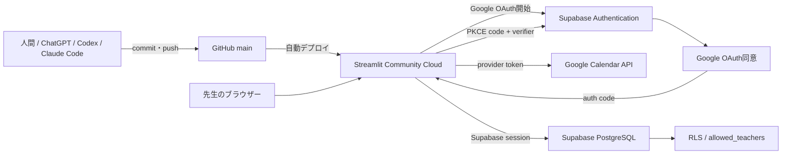

# ChatGPT・Codex・Claude Code 引継ぎ

> [!IMPORTANT]
> このファイルは、次の開発担当者が最初に読む引継ぎ資料です。
> 担当者は人間・ChatGPT・Codex・Claude Codeなどを問いません。
> コードを変更する前に、必ず本ファイルと `docs/04_PROJECT_STATUS.md` を読み、現在の状態を理解してから作業を開始してください。

最終更新日: 2026-07-23

## この文書の目的

数か月後でも10分以内に開発を再開できるように、システム構成、完成済み機能、既知の問題、現在のGit状態、次に行う作業を一か所へまとめます。

この文書に書かれた状態と実際のRepositoryが異なる場合は、`git status`、`git log`、コードを優先し、確認後に本書を更新してください。未コミット変更は所有者の作業であるため、勝手に破棄しません。

> 過去の教訓: 2026-07-23の作業開始時点で、コード（Identity Sequence同期）とテストはコミット済み（`11ec903`）だったにもかかわらず、本ファイルと `docs/04_PROJECT_STATUS.md` は「未コミット」のままの記述で止まっていました。コミットとドキュメント更新は必ずセットで終わらせてください。詳細は `docs/worklog.md` の2026-07-23エントリを参照してください。

## 最初に読む文書

必ず次の順に読みます。

1. `docs/08_CHATGPT引継ぎ.md`（本ファイル）
2. `docs/04_PROJECT_STATUS.md`
3. `docs/worklog.md`（最新エントリ、作業履歴）
4. 必要に応じて `docs/07_トラブルシューティング.md`
5. SQL作業なら `docs/05_よく使うSQL.md`

変更履歴は `docs/09_リリースノート.md` を参照してください。

新しいAIへの最初の依頼文:

```text
まず docs/08_CHATGPT引継ぎ.md、docs/04_PROJECT_STATUS.md、docs/worklog.md を読んでください。現在のGit状態と次回最優先事項を確認し、作業前に実施内容を短く報告してください。
```

## プロジェクト概要

ピアノ教室の生徒、月謝・発表会費請求、現金受領、売上、監査履歴を管理するStreamlitアプリです。

先生はスマートフォンでGoogle Calendarの当日予定を確認し、予定と生徒を照合します。現金封筒へ押印後、`受領・押印済み` を押すと、Supabase上で入金追加、請求状態更新、監査ログ追加が一括実行されます。

- 本番: Streamlit Community Cloud + Supabase + Google OAuth + Google Calendar API
- ローカルデモ: Streamlit + SQLite + 架空Calendar予定
- Repository: `piano-fee-app`
- 本番ブランチ: `main`
- 起動ファイル: `local_web_app/app.py`

## システム構成



| サービス | 役割 |
|---|---|
| GitHub | コード、履歴、`main` ブランチ管理 |
| Streamlit Community Cloud | アプリ公開、Deploy logs、Secrets管理 |
| Supabase PostgreSQL | 生徒、請求、入金、監査、照合、移行履歴 |
| Supabase Authentication | Googleログイン、Supabaseセッション、RLS用JWT |
| Google OAuth | Google本人確認とCalendar読取scopeの同意 |
| Google Calendar API | 当日のレッスン予定取得 |

## 主要フォルダとファイル

```text
piano-fee-app/
├─ docs/
│  ├─ 01_URL一覧.md
│  ├─ 02_起動方法.md
│  ├─ 03_運用マニュアル.md
│  ├─ 04_PROJECT_STATUS.md
│  ├─ 05_よく使うSQL.md
│  ├─ 06_環境変数.md
│  ├─ 07_トラブルシューティング.md
│  ├─ 08_CHATGPT引継ぎ.md
│  ├─ 09_リリースノート.md
│  └─ worklog.md
├─ local_web_app/
│  ├─ app.py
│  ├─ database.py
│  ├─ migrate_to_supabase.py
│  ├─ supabase_schema.sql
│  ├─ supabase_sequence_sync.sql
│  ├─ pages/
│  ├─ services/
│  ├─ tests/
│  └─ .streamlit/
├─ README.md
├─ 設計書.md
└─ ピアノ教室_レッスン料管理.xlsx
```

| ファイル | 役割 |
|---|---|
| `local_web_app/app.py` | Authコールバック、利用許可、画面切替 |
| `services/auth_service.py` | Supabaseクライアント、Google OAuth、PKCE、セッション |
| `services/calendar_service.py` | Calendar API、デモ予定、タイトル正規化 |
| `services/v3_repository.py` | Supabase／SQLite切替、通常受領RPC |
| `services/payment_service.py` | 入金登録、押印、取消 |
| `services/charge_service.py` | 月謝・発表会費請求 |
| `services/student_service.py` | 生徒追加・更新・在籍状態 |
| `services/sales_service.py` | 売上集計。40,000円問題の原因箇所（`received_date`基準で集計し`target_month`を見ていない） |
| `services/export_service.py` | CSV・Excel出力 |
| `services/backup_service.py` | ローカルSQLiteバックアップ |
| `migrate_to_supabase.py` | SQLite移行とIdentity Sequence同期呼出し |
| `supabase_schema.sql` | テーブル、RLS、受領RPC、同期RPC |
| `supabase_sequence_sync.sql` | 既存Supabaseへ同期RPCを追加・即時実行 |
| `tests/test_migrate_to_supabase.py` | Identity Sequence同期テスト |

## データベース構成

| テーブル | 主キー | 用途 |
|---|---|---|
| `students` | `student_id` Identity | 生徒、料金、在籍情報 |
| `charges` | `charge_id` Identity | 月謝・発表会費等の請求 |
| `payments` | `payment_id` Identity | 受領額、支払方法、押印、取消、Calendar event ID |
| `audit_logs` | `log_id` Identity | 操作監査履歴 |
| `allowed_teachers` | `email` | RLSで許可するGoogleアカウント |
| `calendar_mappings` | `normalized_title` | Calendarタイトルと生徒の手動対応 |
| `migration_runs` | `source_sha256` | SQLite二重移行防止 |

重要な制約・RPC:

- `charges`: 生徒・対象月・請求種別が一意
- `payments_calendar_event_once`: 有効な同一Calendar予定の二重受領を拒否
- `complete_lesson_payment`: 請求行ロック、残額確認、入金、請求更新、監査を1トランザクションで実行
- `sync_migration_identity_sequences`: 明示ID移行後に4つのIdentityシーケンスを最大IDへ同期
- RLS: Google JWT emailが `allowed_teachers` にある利用者だけが業務テーブルを操作

## 完成済み機能

- GitHub連携
- Streamlit Community Cloudへの公開
- Supabase接続
- Supabase PostgreSQLとRLS
- Google OAuth
- PKCE verifier永続化
- Google Calendar API連携
- Calendar予定と生徒の自動照合
- 手動照合結果の保存
- SQLiteからSupabaseへのデータ移行
- 今日の受付
- 受領登録
- Identity Sequence同期（実装・コミット済み: `11ec903`）
- 受領登録時のduplicate keyエラー対策
- プロジェクトドキュメント8ファイル作成
- `docs/` のGitHubへのpush
- ローカルデモと自動テスト
- 作業履歴管理（`docs/worklog.md`）の運用開始

## 動作確認済み

- Google Calendarの予定を取得できる
- Calendar予定から生徒を照合できる
- 9,000円の受領登録ができる
- 受領後、今日の売上9,000円になる
- 受領後、受領済み1名になる
- 受領後、未受領0名になる
- Identity Sequence同期テスト4件が成功する
- 全体テストスイート12件が成功する

## 未完成機能・未確認事項

- 売上管理・確定申告画面の集計ロジック修正（原因特定済み、修正方針は承認待ち）
- 受領取消処理の動作確認
- CSV出力の確認・改善
- Excel出力の確認・改善
- 本番データでの総合運用テスト
- `docs/01_URL一覧.md` の本番URL・Project名の未設定部分の追記
- Streamlit本番環境でのブラウザ確認（売上問題の修正方針確定後に実施）

## 既知の問題

### 売上管理・確定申告画面が40,000円と表示される（原因特定済み・修正未適用）

確認済み:

- 9,000円の受領登録は正常
- 今日の受付画面では売上9,000円
- 売上管理・確定申告画面では40,000円
- 内訳として22,000円と18,000円が見えていた

#### 原因（コードレベルで特定済み）

「今日の受付」の「今日の売上」（`pages/v3_today.py`）は、そのブラウザセッション中に受領した分だけを `st.session_state` で合算した値であり、DBには問い合わせていません。一方、「月別売上」（`services/sales_service.py` の `monthly_sales`）は、`payments` テーブルから `cancelled_at is null` の全行を取得し、**`received_date`（受領日）の年月**が一致する行を合算しています。**`target_month`（請求対象月）は見ていません。**

このため、前受金（翌月分を当月中に受領）や後払いの回収、未取消のテスト入金などが同じ暦月に存在すると、「月別売上」は本来のその月の請求額より大きく表示されます。

ローカルデモDBで再現し、以下のとおり確認済みです（実行結果）。

```text
monthly_sales('2026-07') の結果:
{'生徒名': 'あおぞら かなで', '請求種別': '月謝', '売上金額': 22000}
{'生徒名': 'さくら みらい', '請求種別': '月謝', '売上金額': 9000}
```

「あおぞら かなで」は7月分月謝11,000円のところ、8月分月謝（前払い、`target_month='2026-08'`）を7月中に受領していたため、7月の売上に22,000円として合算されました。本番報告の「22,000円」という内訳と数値的に一致する構造です。

本番Supabaseの実データはこの開発環境から直接参照できないため（認証情報なし）、実データでの完全な内訳確認は次のSQLをSupabase SQL Editorで実行して行う必要があります。

```sql
select
  student_name, payment_type, target_month,
  to_char(received_date,'YYYY-MM') as received_month,
  amount_received, received_date, cancelled_at
from public.payments
where cancelled_at is null
  and to_char(received_date,'YYYY-MM') = '対象年月'
order by student_name, received_date;
```

詳細な調査経緯は `docs/04_PROJECT_STATUS.md` の「既知の問題」および `docs/worklog.md` の2026-07-23エントリを参照してください。

修正方針・実装前に、原因、対象ファイル、修正方針をユーザーへ説明し、承認を得ます。

## 今回までの重要な修正

### PKCE

問題: Googleから `?code=...` が戻っても、code verifierがStreamlitの外部リダイレクトと再実行をまたげず、Supabaseセッション交換に失敗しました。

対応:

- PKCEを無効化せず維持
- verifierを期限付きサーバー側SQLiteへ保存
- URLにはverifierではなく推測困難なフローIDだけを付与
- verifierが空ならexchangeしない
- 完了後にverifierとquery parameterを削除
- Supabase sessionとGoogle `provider_token` を保持
- 例外本文やtokenを画面・ログへ出さない

### Google Calendar

- OAuth scopeは `openid email profile` とCalendar読取専用scope
- Calendar APIにはSupabase sessionの `provider_token` をBearer tokenとして使用
- 本番Calendarエラー時は架空予定へ自動フォールバックしない
- Calendar予定取得と生徒照合は動作確認済み

### Identity Sequence

問題: SQLiteのIDを `generated by default as identity` 列へ明示挿入してもシーケンスが進まず、次の受領登録で主キー重複が発生しました。

対応:

- `pg_get_serial_sequence()` でIdentity所有シーケンスを取得
- `setval()` で現在の最大IDへ同期
- 対象は `students`、`charges`、`payments`、`audit_logs`
- 空テーブルは次回1、非空テーブルは次回最大ID+1
- `service_role` 専用RPC
- 移行成功後に同期結果を検証

この対応は、コミット `11ec903`（2026-07-23）で反映済みです。関連テスト4件、全体テスト12件が成功しています。

### Supabase移行

- SQLiteを読み取り専用で開く
- 件数とSHA-256をプレビュー
- `--commit` と `MIGRATE` 入力がある場合だけ書き込む
- 既存主キーを上書きせずスキップ
- 全成功後に `migration_runs` へ指紋を保存
- service-role keyは移行時のPowerShellセッションだけで使用

## 現在のGit状態

- `git status`: クリーン（`nothing to commit, working tree clean`）
- `main` は `origin/main` と同期済みです。
- 最新コミット: `11ec903131cc1368e5e1759b13fe0a83f5be8911`（`Add Supabase identity sequence synchronization`、2026-07-23 14:45）

未コミットの変更はありません。今回のドキュメント更新・売上調査結果は、ユーザーの承認を得るまでコミットしません。

## 次回再開時の手順

### STEP 1: 引継ぎ資料を読む

最初に次を読みます。

- `docs/08_CHATGPT引継ぎ.md`
- `docs/04_PROJECT_STATUS.md`
- `docs/worklog.md`（最新エントリ）

新しいAIへの最初の依頼文:

```text
まず docs/08_CHATGPT引継ぎ.md、docs/04_PROJECT_STATUS.md、docs/worklog.md を読んでください。現在のGit状態と次回最優先事項を確認し、作業前に実施内容を短く報告してください。
```

### STEP 2: 売上集計修正の承認を得る

`docs/04_PROJECT_STATUS.md` の「既知の問題」に記載した原因と修正方針をユーザーへ提示し、承認を得るまでコードを変更しません。

### STEP 3: 承認された方針で修正・テストする

`services/sales_service.py` を修正し、前受金・後払いケースを含む回帰テストを追加して実行します。

```powershell
.\local_web_app\.venv\Scripts\python.exe -m pytest local_web_app/tests
```

失敗した場合、原因を調べる前に大量修正しません。失敗内容、原因候補、必要な変更を説明します。

### STEP 4: 必要な変更だけコミットする

```powershell
git status
git diff
git add <対象ファイル>
git diff --cached
git commit -m "<内容に応じたメッセージ>"
git push origin main
git status
git log -1 --oneline
```

`git diff --cached` に無関係なファイルがあればコミットしません。

### STEP 5: Streamlit本番環境を確認する

Community Cloudの本番アプリを開き、次を順番に確認します。

1. アプリが正常起動する
2. Googleログインができる
3. Google Calendarを取得できる
4. 今日の受付画面が表示される
5. 受領登録ができる
6. 売上管理・確定申告画面の表示が正しい
7. エラーが表示されない

本番URLが `docs/01_URL一覧.md` で未設定なら、確認できた時点で追記します。URLだけを記載し、Secretは書きません。

### STEP 6: 受領取消処理を確認する

売上問題の修正確認後にテストします。

確認項目:

- `payments` を物理削除せず取消状態にできる
- `cancelled_at` と取消理由が保存される
- 対応する `charge` が未受領または請求中へ戻る
- 今日の受領済み人数が減る
- 今日の売上から取消金額が除外される
- `audit_logs` に取消履歴が残る

テストデータと本番データを混同しません。データ操作前に対象を確認します。

### STEP 7: ドキュメントを更新する

作業終了前に必ず更新します。

- `docs/04_PROJECT_STATUS.md`
- `docs/08_CHATGPT引継ぎ.md`
- `docs/worklog.md`

必要に応じて更新します。

- `docs/05_よく使うSQL.md`
- `docs/07_トラブルシューティング.md`
- `docs/01_URL一覧.md`

次回担当者が古い情報で誤操作しない状態にします。

## 開発ルール

1. 秘密情報をGitHubへ保存しない。
2. `SUPABASE_SERVICE_ROLE_KEY` の実値を書かない。
3. Google Client Secretの実値を書かない。
4. JWT、APIキー、GitHub tokenを書かない。
5. Streamlit Secretsの実値を書かない。
6. 環境変数は変数名、用途、取得場所、設定場所だけを書く。
7. コード修正前に `git status` と `git diff` を確認する。
8. 無関係な変更を同じコミットへ混ぜない。
9. 既存の未コミット変更を勝手に破棄しない。
10. 問題が起きても、原因確認前にreset、checkout、cleanを実行しない。
11. ユーザーは一度に一つずつ進める方が分かりやすいため、操作依頼は原則一工程ずつ提示する。
12. コード修正後は、テスト、動作確認、Git状態確認、docs更新の順で終了する。
13. DB操作前に対象Projectとバックアップを確認し、最初はSELECTで状態を確認する。
14. 実データや実メールをAIチャット、Issue、ログ、スクリーンショットへ載せない。
15. コード・テストをコミットしたら、同じ作業の中で `docs/04_PROJECT_STATUS.md`・`docs/08_CHATGPT引継ぎ.md`・`docs/worklog.md` の更新まで終わらせる。ドキュメント更新漏れのまま作業を終えない。

## AIへ依頼するときの開始文

### 開発再開

```text
まず docs/08_CHATGPT引継ぎ.md、docs/04_PROJECT_STATUS.md、docs/worklog.md を読んでください。現在のGit状態と次回最優先事項を確認し、作業前に実施内容を短く報告してください。
```

### 原因調査だけを依頼

```text
まず引継ぎ資料とPROJECT_STATUSを読んでください。原因調査だけを行い、承認するまでコードやデータを変更しないでください。秘密情報は表示しないでください。
```

### 実装を依頼

```text
まず引継ぎ資料、git status、git diffを確認してください。既存の未コミット変更を保護し、対象外の変更を混ぜず、修正・テスト・差分確認まで行ってください。コミットとpushは依頼するまで行わないでください。
```

## 作業終了時の更新ルール

コードや本番状態が変わったら、終了前に次を実施します。

1. 関連テストを実行する。
2. 本番またはローカルで必要な動作確認を行う。
3. `git status` と `git diff` を確認する。
4. `docs/04_PROJECT_STATUS.md` の現在状態、未完了、次回最優先、更新履歴を更新する。
5. 本ファイルのGit状態、完成済み、既知の問題、次回手順を更新する。
6. `docs/worklog.md` に実施内容・変更ファイル・テスト結果・Git状況・決定事項・保留事項・次回作業・申し送りを追記する。
7. 必要に応じてSQL、トラブル、URL文書を更新する。
8. Secretが差分にないことを確認する。
9. 無関係な変更を混ぜずコミットする。

## 10分で再開するチェックリスト

- [ ] 本ファイルを読んだ
- [ ] `docs/04_PROJECT_STATUS.md` を読んだ
- [ ] `docs/worklog.md` の最新エントリを読んだ
- [ ] `git status` を確認した
- [ ] `git diff` と新規ファイルを確認した
- [ ] 売上40,000円問題の原因（`received_date`基準集計）と修正が承認待ちであることを把握した
- [ ] 関連テストを実行する準備ができた
- [ ] 作業前に実施内容を短く報告した
