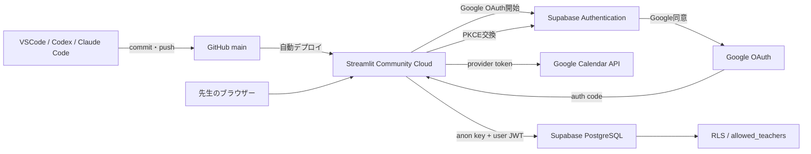

# ChatGPT・Codex・Claude Code 引継ぎ

## 最初にAIへ伝える一文

```text
まず docs/08_CHATGPT引継ぎ.md を読んでください。
次に git status、直近コミット、テスト結果を確認し、既存の未コミット変更を上書きしないでください。
```

最終更新日: 2026-07-17

## プロジェクト概要

ピアノ教室の月謝・発表会費・受領・売上を管理するStreamlitアプリです。先生がスマートフォンでGoogle Calendarの当日予定を確認し、現金封筒へ押印後、`受領・押印済み` を押して入金を確定します。

外部設定がない場合はSQLiteと架空予定によるデモモード、本番はSupabase PostgreSQL、Supabase Authentication、Google OAuth、Google Calendar APIを使います。

## システム構成



### 各サービスの役割

| サービス | 役割 |
|---|---|
| GitHub | コード、履歴、`main` ブランチ管理 |
| Streamlit Community Cloud | `local_web_app/app.py` のホスティング、Secrets管理 |
| Supabase PostgreSQL | 生徒、請求、入金、監査、対応表、移行履歴 |
| Supabase Authentication | Googleログイン、Supabaseセッション、RLS用JWT |
| Google OAuth | Google本人確認、Calendar読取scopeへの同意 |
| Google Calendar API | 今日のレッスン予定取得 |

## フォルダ構成

```text
piano-fee-app/
├─ docs/                         # この引継ぎ・運用文書
├─ local_web_app/                # 現行Streamlitアプリ
│  ├─ app.py                     # 起動ファイル・画面ルーティング
│  ├─ database.py                # ローカルSQLiteスキーマ・初期化
│  ├─ migrate_to_supabase.py     # SQLite→Supabase移行
│  ├─ supabase_schema.sql        # 本番DB、RLS、RPC
│  ├─ supabase_sequence_sync.sql # 既存ProjectのIdentity同期
│  ├─ pages/                     # Streamlit画面
│  ├─ services/                  # 認証・Calendar・業務ロジック
│  ├─ tests/                     # pytestとデモ受入テスト
│  └─ .streamlit/                # configとSecrets見本
├─ README.md                     # 旧Excel版の説明
├─ 設計書.md                     # 旧Excel版の設計
└─ ピアノ教室_レッスン料管理.xlsx # 旧運用資産
```

## 主要ファイル

| ファイル | 役割 |
|---|---|
| `local_web_app/app.py` | Authコールバック、許可判定、画面切替 |
| `services/auth_service.py` | Supabaseクライアント、PKCE、セッション、Google OAuth |
| `services/calendar_service.py` | Calendar APIとデモ予定取得、タイトル正規化 |
| `services/v3_repository.py` | Supabase／SQLite切替、通常受領RPC呼出し |
| `services/payment_service.py` | 入金登録、押印、取消 |
| `services/charge_service.py` | 月謝・発表会費請求作成 |
| `services/student_service.py` | 生徒追加・更新・在籍状態 |
| `services/sales_service.py` | 売上集計 |
| `services/export_service.py` | CSV・Excel出力 |
| `services/backup_service.py` | ローカルSQLiteバックアップ |
| `supabase_schema.sql` | 本番テーブル、RLS、受領RPC、同期RPC |
| `migrate_to_supabase.py` | 読取専用プレビュー、重複スキップ、移行指紋、Sequence同期 |

## DB構成

| テーブル | 主キー | 内容 |
|---|---|---|
| `students` | `student_id` Identity | 生徒、料金、在籍情報 |
| `charges` | `charge_id` Identity | 月謝・発表会費等の請求 |
| `payments` | `payment_id` Identity | 入金、押印、取消、Calendar event ID |
| `audit_logs` | `log_id` Identity | 操作監査履歴 |
| `allowed_teachers` | `email` | RLSで許可するGoogleアカウント |
| `calendar_mappings` | `normalized_title` | Calendarタイトルと生徒の手動対応 |
| `migration_runs` | `source_sha256` | SQLite二重移行防止 |

### 重要なDB制約・RPC

- `charges`: 生徒・対象月・請求種別が一意
- `payments_calendar_event_once`: 有効な同一Calendar予定の二重入金を拒否
- `complete_lesson_payment`: 行ロック、残額確認、入金、請求更新、監査を1トランザクションで実行
- `sync_migration_identity_sequences`: 明示ID移行後に4つのIdentityシーケンスを最大IDへ同期
- RLS: `allowed_teachers` とGoogle JWT emailを照合

## 完成済み機能

- GitHub／Community Cloud連携
- Supabase PostgreSQLとRLS
- Google OAuthログイン
- Google Calendar当日予定取得
- 生徒名の安全な自動照合と手動対応保存
- 今日の受付
- 受領・押印済み一括登録
- 生徒管理
- 月謝・発表会費請求
- 入金取消ロジック
- 未入金、売上集計
- CSV・Excel出力ロジック
- SQLiteデモ、バックアップ、Supabase移行
- PKCE verifier永続化
- Identity Sequence同期
- pytestとデモ受入テスト

## 未完成・本番未確認

- 本番データでの売上画面最終確認
- 本番データでの取消処理最終確認
- CSVの内容・文字コード確認
- Excelの内容・書式確認
- Identity Sequence同期SQLの本番実行確認
- Google provider token期限切れ時の運用確認
- スマートフォン実機での継続的UI改善

## 現在の課題

1. `payments_pkey` 重複対策として、既存SupabaseでSequence同期SQLを実行する
2. 受領後に売上へ正しく反映されるか確認する
3. 取消後に請求状態・売上が戻るか確認する
4. CSV・Excelを実データ相当で検収する
5. 運用テスト結果を `04_PROJECT_STATUS.md` へ記録する

## 今回実施した重要修正

### PKCE

問題: Googleから `?code=...` が戻ってもcode verifierがStreamlit再実行をまたげず、交換に失敗しました。

修正:

- SupabaseのPKCEを維持
- verifierを期限付きサーバー側SQLiteへ保存
- URLにはランダムなフローIDのみ付与
- verifierなしではexchangeしない
- 完了後にverifierとquery parameterを削除
- Supabase sessionとGoogle provider tokenを保持
- 例外本文やtokenを画面へ表示しない

### Calendar

- scope: `openid email profile https://www.googleapis.com/auth/calendar.readonly`
- APIのBearer token: Supabase sessionの `provider_token`
- tokenがないデモモードだけモック予定を使用
- 本番Calendarエラー時に架空予定へ自動フォールバックしない

### Identity Sequence

問題: SQLiteの明示IDを `generated by default as identity` 列へ入れてもPostgreSQLシーケンスが進まず、次のINSERTが主キー重複しました。

修正:

- `pg_get_serial_sequence()` でIdentity所有シーケンスを取得
- `setval()` で現在の最大IDへ同期
- 対象はstudents、charges、payments、audit_logs
- 空テーブルは次回1、非空テーブルは次回最大ID+1
- `service_role` 専用RPC
- 移行成功後に自動同期し、結果を検証

### Supabase移行

- 元SQLiteを読み取り専用で開く
- 実行前は件数とSHA-256だけをプレビュー
- `--commit` と `MIGRATE` 入力がそろった場合だけ書き込む
- 既存主キーは上書きせずスキップ
- 全成功後に `migration_runs` へ指紋を保存
- service-role keyは移行時のPowerShellだけで使用

## 今後予定している機能・改善

- 本番データ登録と運用受入テスト
- 売上・取消・出力画面の改善
- スマートフォン操作性改善
- provider token更新または明確な再ログイン案内
- PDF領収書
- 月謝変更履歴
- 発表会費分割
- 出席・振替
- LINE／メール通知
- 口座振替結果取込

## 開発ルール

1. Secret、APIキー、token、実メール、Database PasswordをGitへ保存しない
2. 実値入り `secrets.toml`、`.env`、DB、backup、exportsをコミットしない
3. READMEやdocsへSecretを書かない
4. service-role keyをStreamlit Secretsやアプリコードへ入れない
5. Google Client SecretをSupabase Provider以外へ保存しない
6. 作業前後に `git status` と `git diff` を確認する
7. 既存の未コミット変更を勝手に破棄・上書きしない
8. DB変更は最初にSELECTで状態確認し、バックアップと対象Projectを確認する
9. コード変更後はcompileall、pytest、必要な受入テストを実行する
10. 本番確認結果を `04_PROJECT_STATUS.md` に追記する

## AIへの依頼方法

### 開発再開

```text
まず docs/08_CHATGPT引継ぎ.md を読んでください。
git statusと直近コミットを確認し、現在の課題を3行で報告してください。
秘密情報は表示・変更しないでください。
```

### バグ調査

```text
まず docs/08_CHATGPT引継ぎ.md と docs/07_トラブルシューティング.md を読んでください。
原因調査だけを行い、承認するまでコードやデータを変更しないでください。
```

### 実装

```text
まず引継ぎ資料とgit statusを確認してください。
既存の未コミット変更を保護し、修正・テスト後に差分を報告してください。
コミットとpushは依頼するまで行わないでください。
```

## 10分で再開するチェックリスト

- [ ] このファイルを読む
- [ ] `docs/04_PROJECT_STATUS.md` を読む
- [ ] `git status` を確認する
- [ ] `git log -5 --oneline` を確認する
- [ ] `local_web_app/README.md` の本番手順を必要箇所だけ読む
- [ ] 仮想環境を有効化する
- [ ] `python -m pytest -q` を実行する
- [ ] 今日の作業目的をPROJECT_STATUSへ記録する
